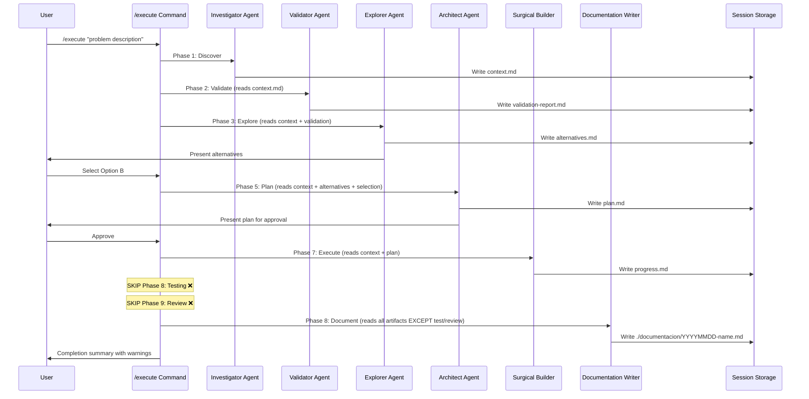

# Implementation Plan: Create /execute Command

**Session**: investigator-1762190736 | **Date**: 2025-11-03 | **Complexity**: Medium

## Executive Summary

- **Goal**: Create new `/execute` command that provides systematic workflow with solution exploration but skips testing and review phases
- **Approach**: Copy workflow.md, remove phases 8-9, renumber phase 10→8, update messaging
- **Effort**: 30-45 minutes
- **Risk**: Low (well-established pattern, simple file creation)

## Architecture

### Command Comparison Flow

```mermaid
graph TD
    subgraph "Command Positioning"
    A[User Task] --> B{Need Exploration?}
    B -->|No| C{Need Validation?}
    B -->|Yes| D{Need Validation?}

    C -->|Yes| E[/build<br/>6 phases<br/>with test/review]
    C -->|No| F[/implement<br/>4 phases<br/>fast mode]

    D -->|Yes| G[/workflow<br/>10 phases<br/>full systematic]
    D -->|No| H[/execute<br/>8 phases<br/>NEW COMMAND]

    style H fill:#ff9,stroke:#333,stroke-width:3px
    end
```

### Phase Flow Comparison

```mermaid
graph LR
    subgraph "/workflow (10 phases)"
    W1[Discover] --> W2[Validate] --> W3[Explore] --> W4[Select] --> W5[Plan] --> W6[Approve] --> W7[Implement] --> W8[Test] --> W9[Review] --> W10[Document]
    end

    subgraph "/execute (8 phases - NEW)"
    E1[Discover] --> E2[Validate] --> E3[Explore] --> E4[Select] --> E5[Plan] --> E6[Approve] --> E7[Implement] --> E8[Document]
    style E8 fill:#ff9
    end

    subgraph "/implement (4 phases)"
    I1[Research] --> I2[Plan] --> I3[Approve] --> I4[Implement]
    end

    subgraph "/build (6 phases)"
    B1[Research] --> B2[Plan] --> B3[Approve] --> B4[Implement] --> B5[Test] --> B6[Review]
    end
```



### Session Data Flow



## Key Design Decisions

### 1. Command Name: `/execute`

**Rationale**:
- Emphasizes execution of explored and approved plan
- Differentiates from `/implement` (which doesn't explore)
- Differentiates from `/workflow` (which includes validation)
- Action verb consistent with command naming pattern
- Clear intent: "execute the plan without validation gates"

**Rejected Alternatives**:
- `/rapid` - Misleading (exploration is NOT rapid)
- `/quick-workflow` - Too verbose, implies shortcut
- `/deliver` - Implies production-ready when it's not tested

### 2. Keep Documentation Phase

**Rationale**:
- Creates permanent knowledge base
- Documents which alternatives were considered
- Valuable for future reference
- Minimal overhead compared to value
- Only phase that writes outside session directory

**Trade-off**: Adds 1 minute to workflow, but creates lasting value

### 3. Dual Warning Messages

**Rationale**:
- **Welcome message**: Set expectations upfront (user knows what they're getting)
- **Completion summary**: Remind about manual steps (actionable next steps)

**Pattern from /implement**: Single warning at end works there because it's fast (4 phases). Our 8-phase workflow needs upfront clarity.

### 4. Session Directory: `.claude/sessions/execute/`

**Rationale**:
- Follows established convention
- Matches command name
- Hooks will automatically manage lifecycle

## Implementation Phases

### Prerequisites
- [x] Context gathered (investigator already completed)
- [x] Pattern validated (workflow.md, implement.md, build.md reviewed)
- [ ] Session environment validated

### Phase 1: Create Command File

**Goal**: Create `/execute` command based on workflow.md

**Steps**:

1. **Copy workflow.md to execute.md**
   - Action: Copy exito/commands/workflow.md → exito/commands/execute.md
   - Files: `/Users/usuario1/Documents/me/ai/claude-marketplace/exito/commands/execute.md`
   - Verify: File exists and is readable

2. **Update frontmatter**
   - Action: Modify YAML frontmatter with new description
   - Files: `exito/commands/execute.md` (lines 1-5)
   - New content:
     ```yaml
     ---
     description: "Systematic workflow with solution exploration and surgical implementation. Skips testing and review - use for rapid prototyping or when you'll validate manually."
     argument-hint: "Describe the problem to solve"
     allowed-tools: Task
     ---
     ```
   - Verify: YAML is valid, description is clear

3. **Update welcome message**
   - Action: Replace welcome section with 8-phase workflow description
   - Files: `exito/commands/execute.md` (lines 7-23)
   - New content:
     ```markdown
     # Systematic Execution Workflow

     **Welcome!** I solve problems following a rigorous 8-phase workflow:

     1. 🔍 **Discover** - Deep context gathering
     2. ✅ **Validate** - Ensure sufficient information
     3. 🧠 **Explore** - Generate 2-4 solution alternatives
     4. 🎯 **Select** - You choose the best approach
     5. 📋 **Plan** - Detailed implementation roadmap
     6. ⏸️ **Approve** - You review and approve plan
     7. ✂️ **Execute** - Surgical implementation (minimal edits, no comments)
     8. 📝 **Document** - Knowledge base creation

     **⚠️ Note**: This workflow skips formal testing and code review. Use when you need systematic exploration but will handle validation manually.

     This workflow emphasizes **exploration before commitment** and **execution without validation gates**.
     ```
   - Verify: Phase count is 8, warning is prominent

**Checkpoint**: Command file created with correct metadata and welcome message

### Phase 2: Update Session Directory References

**Goal**: Change all session paths from /workflow/ to /execute/

**Steps**:

1. **Global find-replace for session paths**
   - Action: Replace `.claude/sessions/workflow/` with `.claude/sessions/execute/` throughout file
   - Files: `exito/commands/execute.md` (all occurrences)
   - Pattern: Find: `workflow/` → Replace: `execute/`
   - Verify: No references to "workflow" session directory remain

**Checkpoint**: All session paths point to execute directory

### Phase 3: Remove Testing Phase

**Goal**: Delete Phase 8 (Testing) completely

**Steps**:

1. **Remove Phase 8 section**
   - Action: Delete lines 225-252 (entire "Phase 8: Testing & Validation" section)
   - Files: `exito/commands/execute.md`
   - Remove:
     ```markdown
     ## Phase 8: Testing & Validation 🧪

     Running comprehensive tests...

     <Task agent="validator">
     ...
     </Task>
     ```
   - Verify: No references to validator agent or test_report.md in main flow

**Checkpoint**: Testing phase completely removed

### Phase 4: Remove Review Phase

**Goal**: Delete Phase 9 (Review) completely

**Steps**:

1. **Remove Phase 9 section**
   - Action: Delete lines that were Phase 9 (entire "Code Review" section)
   - Files: `exito/commands/execute.md`
   - Remove:
     ```markdown
     ## Phase 9: Code Review 👀

     Final quality assurance...

     <Task agent="auditor">
     ...
     </Task>
     ```
   - Verify: No references to auditor agent or review.md in main flow

**Checkpoint**: Review phase completely removed

### Phase 5: Renumber and Update Documentation Phase

**Goal**: Change Phase 10 → Phase 8 and update agent invocation

**Steps**:

1. **Renumber phase heading**
   - Action: Change "## Phase 10: Documentation" → "## Phase 8: Documentation"
   - Files: `exito/commands/execute.md`
   - Verify: Heading is now Phase 8

2. **Update documentation-writer invocation**
   - Action: Modify agent task to exclude test/review files
   - Files: `exito/commands/execute.md` (documentation section)
   - New content:
     ```markdown
     <Task agent="documentation-writer">
       Create comprehensive documentation for: $ARGUMENTS

     Session directory: .claude/sessions/execute/$CLAUDE_SESSION_ID

     Your goals:

     1. Read session artifacts: context.md, validation-report.md, alternatives.md, plan.md, progress.md
     2. NOTE: test_report.md and review.md do NOT exist (testing/review were skipped)
     3. Synthesize into comprehensive documentation
     4. Save to `./documentacion/{YYYYMMDD}-{brief-name}.md`
     5. Include executive summary, alternatives considered, implementation details, lessons learned
     6. Document that testing and review were skipped

     Output documentation to: `./documentacion/`

     Return location of created documentation file.
     </Task>
     ```
   - Verify: Agent knows to skip test/review sections

**Checkpoint**: Documentation phase renumbered and updated

### Phase 6: Update Completion Summary

**Goal**: Add completion message with appropriate warnings

**Steps**:

1. **Replace workflow completion section**
   - Action: Update final summary with 8-phase checklist and warnings
   - Files: `exito/commands/execute.md` (final section)
   - New content:
     ```markdown
     ## Workflow Complete ✅

     **Problem Solved**: $ARGUMENTS

     **Workflow Summary**:

     - ✅ Context gathered and validated
     - ✅ Multiple alternatives explored
     - ✅ Solution selected by you
     - ✅ Plan approved by you
     - ✅ Implementation executed with surgical precision
     - ⏭️ Testing skipped (manual validation required)
     - ⏭️ Code review skipped (manual review recommended)
     - ✅ Documentation created

     **Session Artifacts**: `.claude/sessions/execute/$CLAUDE_SESSION_ID/`

     - `context.md` - Problem analysis
     - `validation-report.md` - Requirements validation
     - `alternatives.md` - Solution options explored
     - `plan.md` - Implementation plan
     - `progress.md` - Implementation log

     **Documentation**: `./documentacion/{YYYYMMDD}-{name}.md`

     **⚠️ Important - Manual Steps Required**:

     - **Testing needed** - This workflow skipped automated testing
       - Run test suite manually: `npm test` or equivalent
       - Test in local environment before deploying
       - Verify edge cases and error scenarios

     - **Code review recommended** - No formal review was performed
       - Review changes yourself: `git diff`
       - Consider peer review before merging to main
       - Check for security issues or performance concerns

     **When to use /workflow instead**:

     - Production-critical features → Use `/workflow` (includes testing + review)
     - Security-sensitive code → Use `/workflow`
     - Complex refactoring → Use `/workflow`
     - Team collaboration → Use `/workflow`

     **When /execute is appropriate**:

     - Rapid prototyping with plan to validate later
     - Experimental features in isolated branches
     - Personal projects where you control quality gates
     - When you prefer manual validation over automated

     ---

     **Note**: This workflow prioritized systematic exploration (multiple options) and surgical execution (minimal edits, no comments) while skipping formal validation gates. 🎯

     Thank you for using the execution workflow! 🚀
     ```
   - Verify: Warnings are prominent, guidance is actionable

**Checkpoint**: Completion summary includes clear warnings and guidance

### Phase 7: Final Validation

**Goal**: Ensure file is complete and correct

**Steps**:

1. **Verify phase numbering**
   - Action: Check all phase headers are sequential 1-8
   - Files: `exito/commands/execute.md`
   - Expected: Phases 1, 2, 3, 4, 5, 6, 7, 8 (no gaps)
   - Verify: No reference to Phase 9 or Phase 10

2. **Verify session directory consistency**
   - Action: Search for any remaining "workflow" references in session paths
   - Files: `exito/commands/execute.md`
   - Expected: All paths use `.claude/sessions/execute/`
   - Verify: `grep -n "sessions/workflow" execute.md` returns nothing

3. **Verify agent invocations**
   - Action: Count Task invocations
   - Files: `exito/commands/execute.md`
   - Expected: 6 Task blocks (investigator, requirements-validator, solution-explorer, architect, surgical-builder, documentation-writer)
   - Verify: No validator or auditor tasks present

4. **Verify frontmatter**
   - Action: Check YAML is valid and description is accurate
   - Files: `exito/commands/execute.md` (lines 1-5)
   - Verify: Description mentions "skips testing and review"

**Checkpoint**: File is complete, correct, and ready for use

## Testing Strategy

### Manual Verification Checklist

After implementation, test the command:

- [ ] File syntax is valid markdown
- [ ] YAML frontmatter parses correctly
- [ ] Session directory pattern is consistent (`.claude/sessions/execute/`)
- [ ] All 8 phases are properly numbered (1-8, no gaps)
- [ ] No references to removed phases (8: Testing, 9: Review)
- [ ] Documentation phase correctly updated to Phase 8
- [ ] Warning messages are present in welcome and completion
- [ ] Agent invocations reference correct session paths

### Integration Testing

Test in local plugin installation:

```bash
# Install locally
/plugin marketplace add /Users/usuario1/Documents/me/ai/claude-marketplace
/plugin install exito@local

# Test command exists
/help execute

# Test command execution (with simple task)
/execute "add a console.log statement to main.ts"

# Verify session directory created
ls -la .claude/sessions/execute/

# Verify phases execute in order
# Verify documentation phase runs without test/review files
# Verify completion warnings are shown
```

### Comparison Testing

Verify differences from /workflow:

| Aspect | /workflow | /execute | ✓ |
|--------|-----------|----------|---|
| Phases | 10 | 8 | |
| Testing | Yes (Phase 8) | No (skipped) | |
| Review | Yes (Phase 9) | No (skipped) | |
| Documentation | Yes (Phase 10) | Yes (Phase 8) | |
| Session dir | workflow/ | execute/ | |
| Warning messages | None | Yes (2 locations) | |

## Risk Assessment

| Risk | Likelihood | Impact | Mitigation |
|------|-----------|--------|------------|
| User confusion with /implement | Medium | Low | Clear description in frontmatter distinguishing exploration vs no-exploration |
| User forgets to test | High | Medium | Prominent warnings in welcome message AND completion summary |
| Documentation phase fails without test files | Low | Low | Explicit note in agent invocation that files won't exist |
| Session directory collision | Low | Low | Standard session ID mechanism prevents collisions |
| Missing validation | High | Medium | Warning messages explicitly call out what's missing and when to use /workflow instead |
| Copy-paste errors from workflow.md | Medium | Low | Thorough find-replace and verification steps |

## Rollback Plan

If implementation fails:

1. **Delete incomplete file**: `rm exito/commands/execute.md`
2. **Verify no plugin.json changes**: (none are planned)
3. **Reload plugin**: `/plugin disable exito && /plugin enable exito`
4. **Document what went wrong**: Add notes to session directory

No other files are modified, so rollback is simple file deletion.

## Success Criteria

**Must Have**:
- [x] Command file created at `exito/commands/execute.md`
- [ ] YAML frontmatter valid with accurate description
- [ ] 8 phases properly numbered and sequenced
- [ ] Session directory consistently `.claude/sessions/execute/`
- [ ] No references to testing (Phase 8) or review (Phase 9) in flow
- [ ] Documentation phase updated to Phase 8
- [ ] Warning messages in welcome AND completion
- [ ] Command appears in `/help` output

**Should Have**:
- [ ] Clear differentiation from /workflow and /implement in description
- [ ] Actionable guidance in warning messages
- [ ] Documentation agent knows test/review files won't exist
- [ ] Completion summary includes "when to use /workflow instead" guidance

**Nice to Have**:
- [ ] Example use cases in completion summary
- [ ] Emoji consistency with other commands
- [ ] Professional, clear writing throughout

## File Modifications Summary

**New Files**:
- `exito/commands/execute.md` - New command file (356 lines, modified from workflow.md)

**Modified Files**:
- None (this is a pure file creation task)

**Deleted Files**:
- None

## Estimated Effort

- Phase 1: Create command file - 5 minutes
- Phase 2: Update session paths - 2 minutes
- Phase 3: Remove testing phase - 3 minutes
- Phase 4: Remove review phase - 3 minutes
- Phase 5: Renumber documentation - 5 minutes
- Phase 6: Update completion - 10 minutes
- Phase 7: Final validation - 5 minutes
- Testing: 10 minutes

**Total: 30-45 minutes**

## Implementation Notes

### Key Pattern Recognition

This follows the **command composition pattern** used throughout exito:

1. **Base template** (workflow.md) provides full systematic approach
2. **Specialized variants** remove or modify phases for specific use cases:
   - `/build` = workflow without exploration
   - `/implement` = workflow without exploration OR validation
   - `/execute` = workflow without validation (NEW)
   - `/patch` = workflow without exploration, with minimal planning

### Architecture Decision: Why Keep Documentation?

The documentation phase creates value that outlasts the session:

1. **Knowledge base** for future similar problems
2. **Exploration record** showing alternatives considered
3. **Decision rationale** for why approach was chosen
4. **Permanent artifact** outside session directory

Cost: ~1 minute
Benefit: Searchable knowledge for entire team

This is the ONLY phase that writes outside `.claude/sessions/`, making it strategically valuable.

### User Experience Considerations

**Expectation setting**: The dual warning approach (welcome + completion) ensures users:
1. Know upfront what they're getting (welcome message)
2. Know what to do next (completion summary)

**Decision support**: Completion summary includes "when to use /workflow instead" to guide users toward the right tool.

**Transparency**: Both skipped phases are explicitly called out with ⏭️ emoji in completion checklist.

---

**Plan Status**: READY FOR REVIEW AND APPROVAL

**Next Step**: User approval required before implementation begins
