# Mermaid Diagram Templates for Architect Agent

This file provides reference templates that the architect agent can use when creating visual architecture diagrams.

## System Architecture Diagrams

### Basic Component Relationship (graph TD)
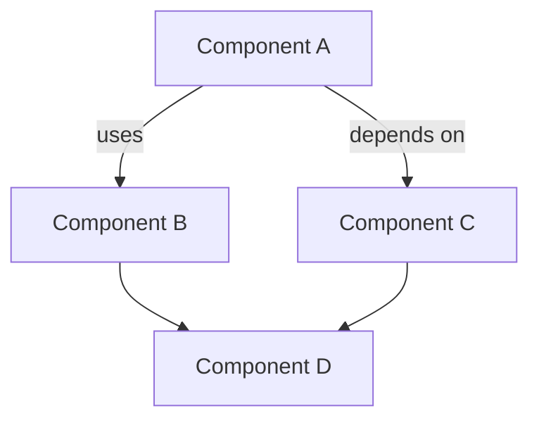

### Layered Architecture
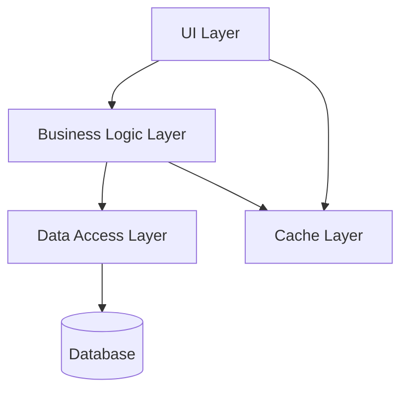

### Microservices Architecture
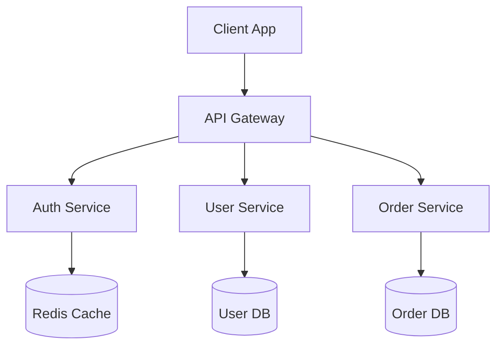

### Plugin Architecture
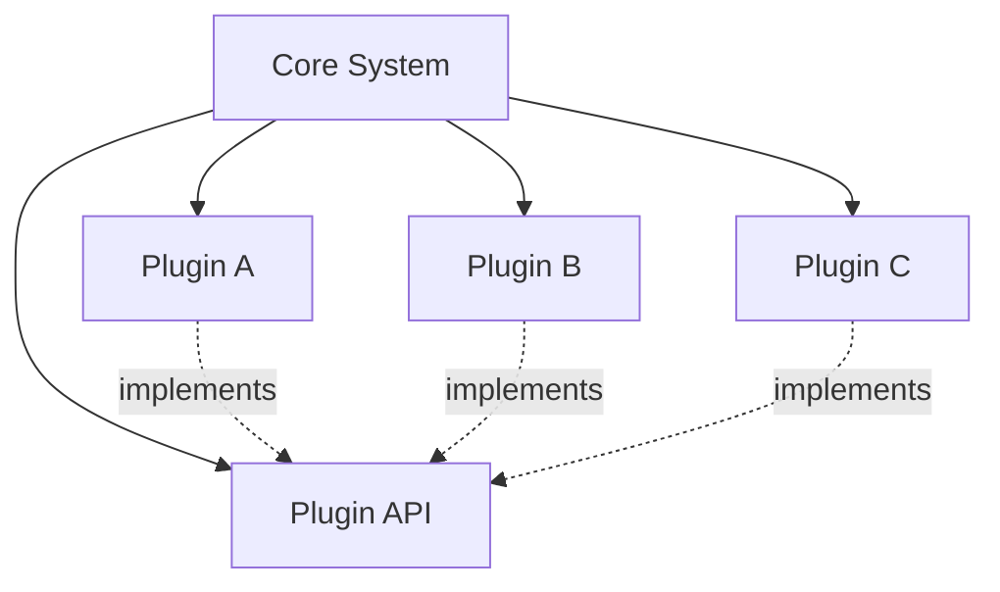

## Data Flow Diagrams (sequenceDiagram)

### User Authentication Flow
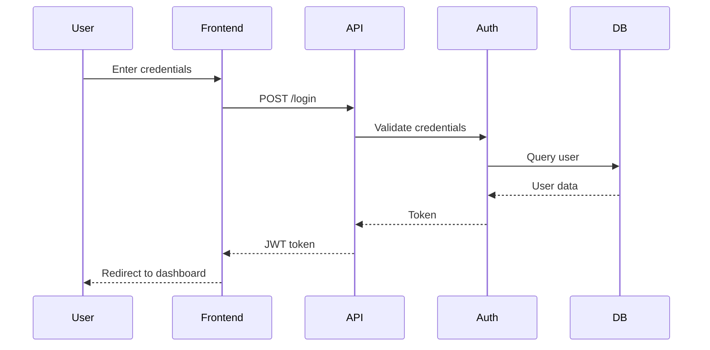

### Data Processing Pipeline
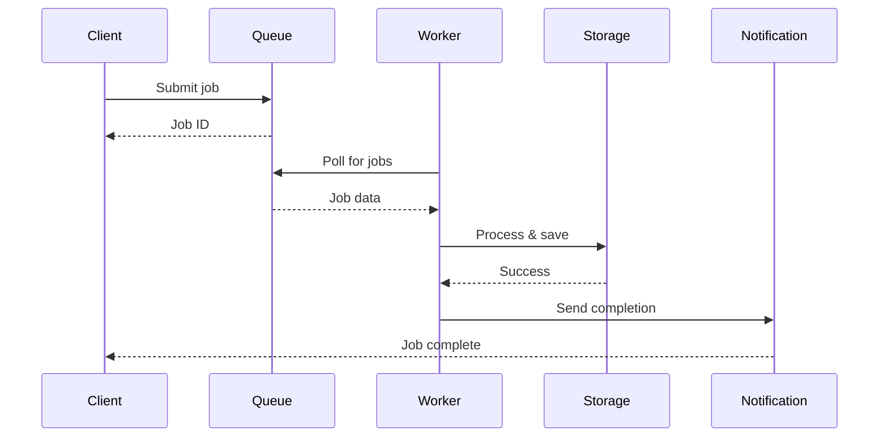

### API Request Flow
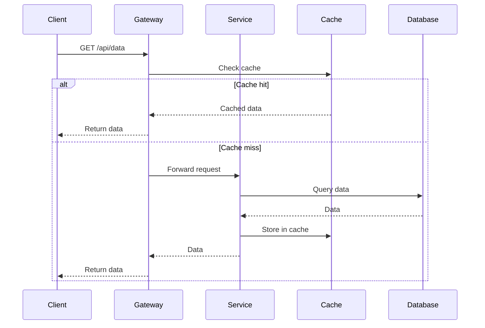

## Component Structure (classDiagram)

### Data Model Relationships
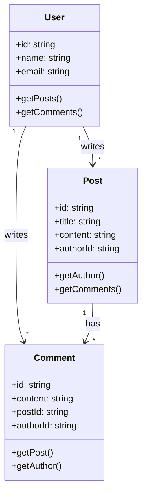

### Service Dependencies
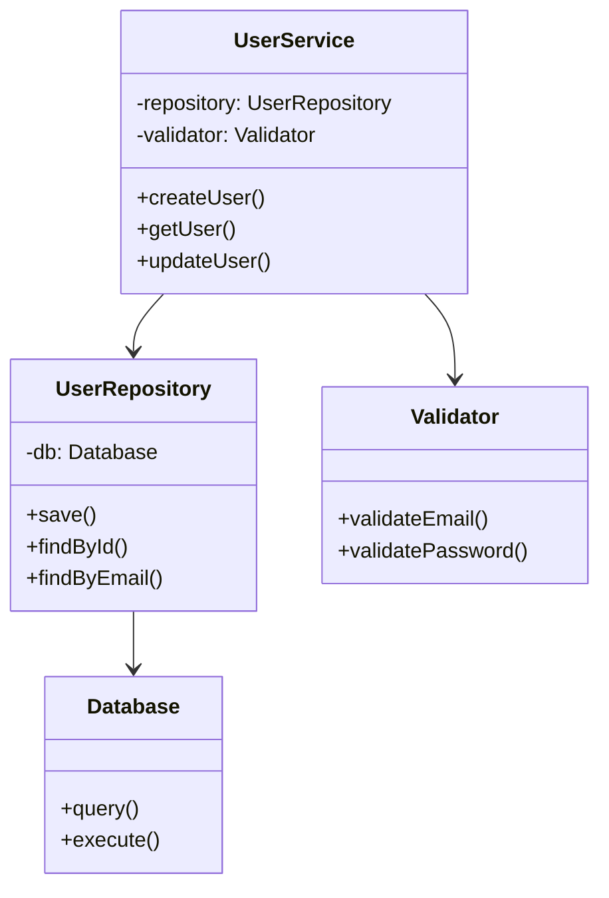

### Interface Implementation
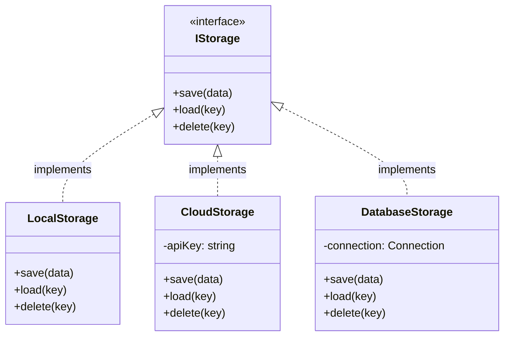

## State Management Flow (graph LR)

### React State Flow
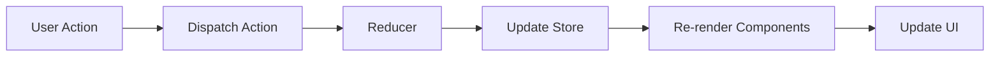

### Event-Driven Architecture
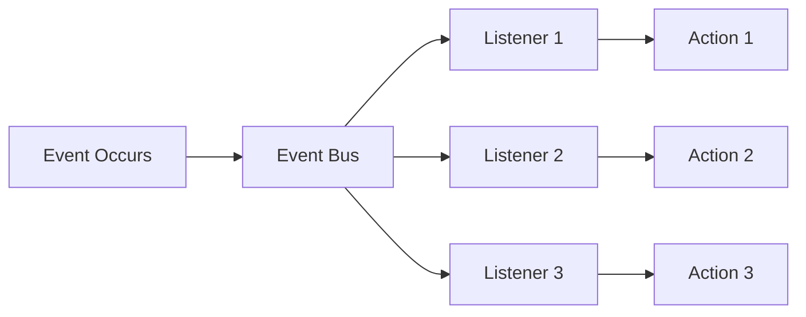

## Frontend Component Hierarchy

### React Component Tree
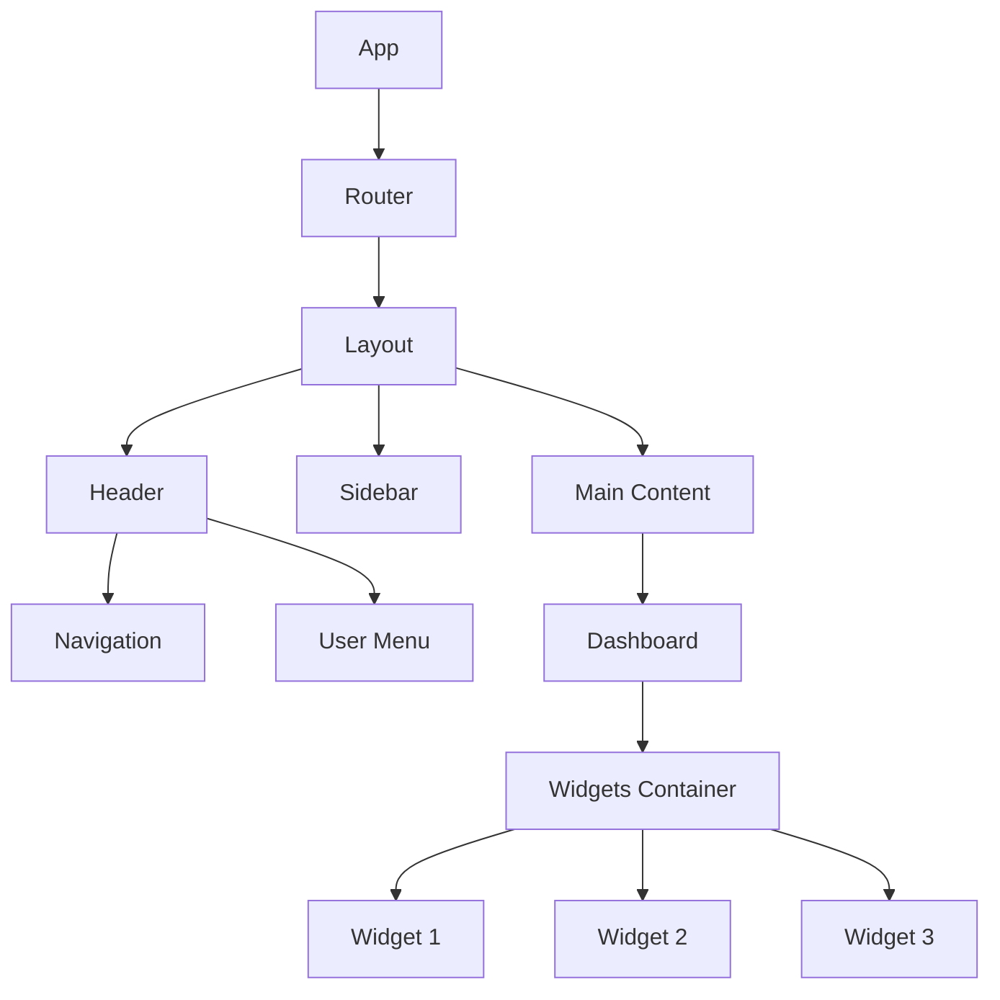

### Component Data Flow
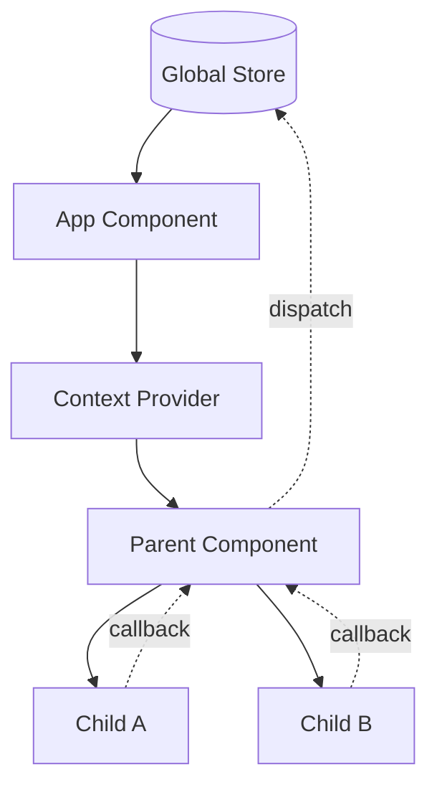

## Deployment Architecture

### Multi-Environment Setup
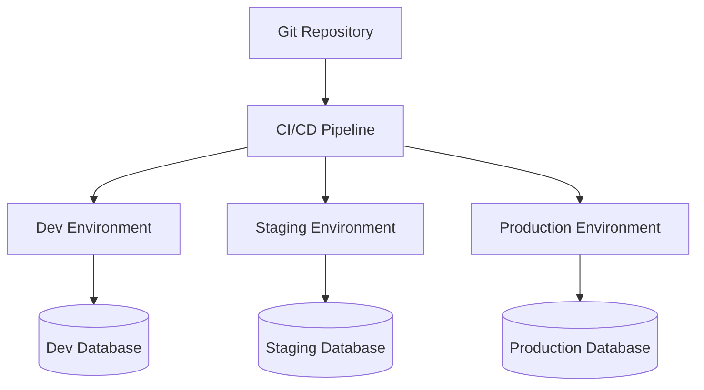

### Container Architecture
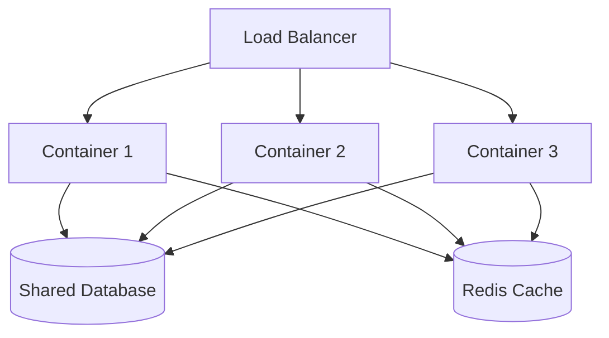

## When to Use Which Diagram Type

### graph TD (Top-Down Graph)
- **Use for**: Component relationships, hierarchies, system architecture
- **Best when**: Showing how parts relate to each other
- **Direction**: `TD` (top-down), `LR` (left-right), `RL` (right-left), `BT` (bottom-top)

### sequenceDiagram
- **Use for**: Time-based interactions, API flows, user journeys
- **Best when**: Showing order of operations and communication between actors
- **Key feature**: Shows temporal sequence of events

### classDiagram
- **Use for**: Data models, object relationships, interface definitions
- **Best when**: Showing structure and relationships of classes/objects
- **Key feature**: Shows inheritance, composition, and associations

### graph LR (Left-Right Graph)
- **Use for**: Process flows, pipelines, state transitions
- **Best when**: Showing linear or branching processes
- **Key feature**: Horizontal flow is easier to read for sequential processes

## Tips for Effective Diagrams

1. **Keep it simple**: 5-10 nodes max per diagram
2. **Use clear labels**: Describe relationships with verbs
3. **Group related concepts**: Use subgraphs if needed
4. **Choose appropriate direction**: TD for hierarchy, LR for flow
5. **Add context**: Brief description above each diagram
6. **One concept per diagram**: Don't try to show everything
7. **Use consistent naming**: Match code/file names when possible
8. **Color sparingly**: Only to highlight critical paths (if supported)

## Example: Complete Architecture Plan with Multiple Diagrams

### System Overview
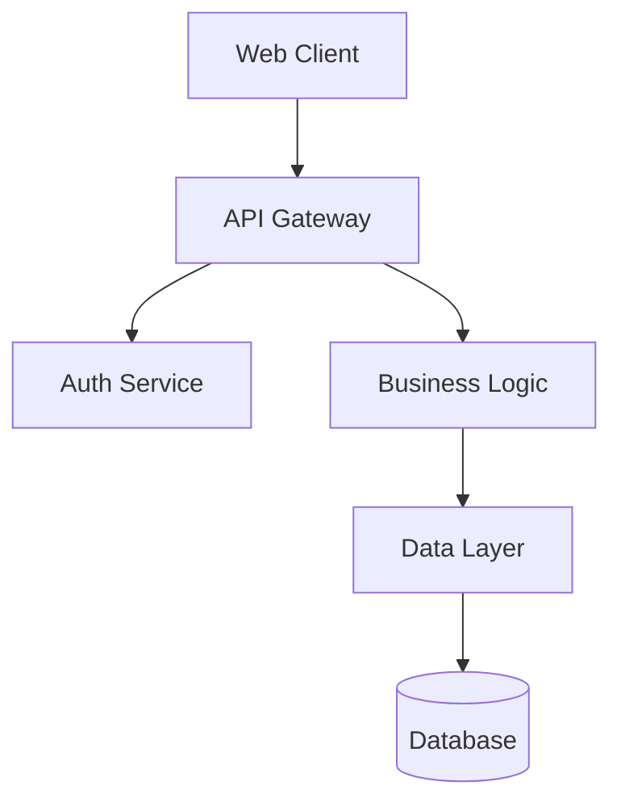

### Request Flow Detail
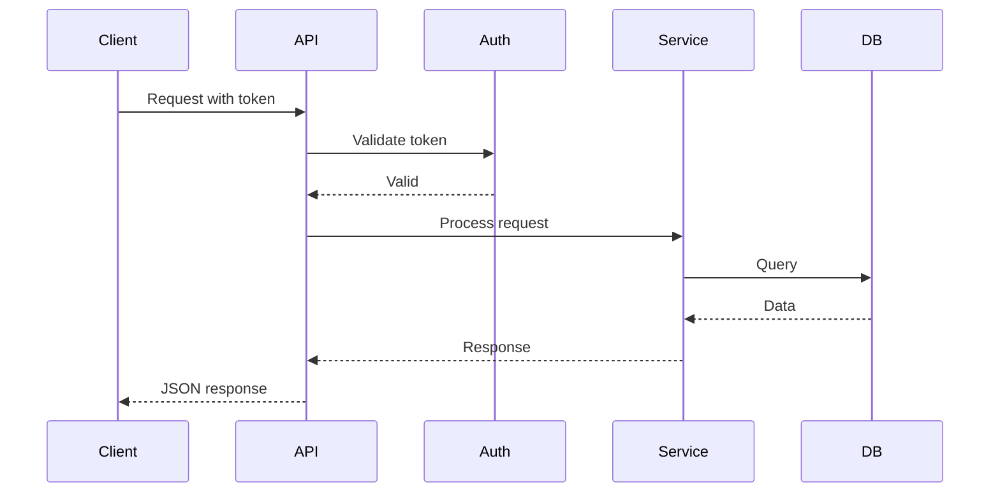

### Data Model
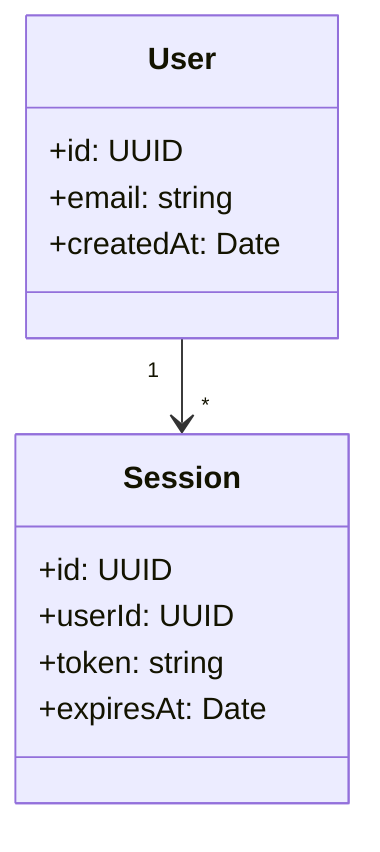

This combination gives a complete picture: structure (graph), behavior (sequence), and data (class).
